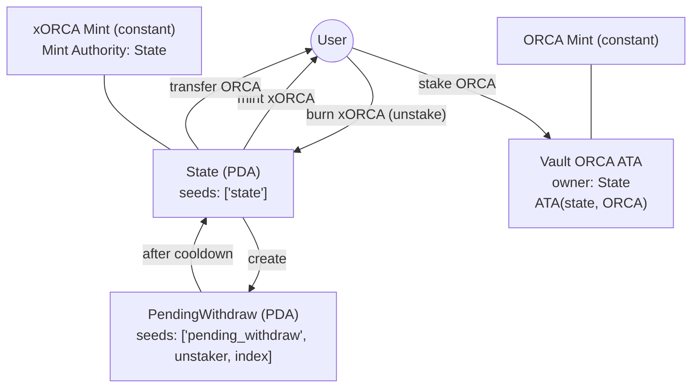

# xORCA Staking Program

A Solana program that implements a staking pool model for ORCA with a liquid staking token, xORCA. Users deposit ORCA to receive xORCA proportional to their share of the pool and can later burn xORCA to initiate an unstake with a cooldown, completing withdrawal once the cooldown elapses. The program uses deterministic PDAs for core authorities and relies on SPL Token and Associated Token Account CPIs. The program emits Borsh-serialized events for Stake/Unstake/Withdraw.

**Program Id**: `StaKE6XNKVVhG8Qu9hDJBqCW3eRe7MDGLz17nJZetLT`

## Key Features

- **Liquid Staking**: Single-sided ORCA deposit; mints xORCA as a proportional share of non-escrowed ORCA in the vault
- **Unstake Flow**: Burns xORCA, creates a pending withdrawal with a cooldown; user completes withdrawal after the cooldown
- **Cooldown System**: Global cooldown expressed in seconds; set at initialization and updatable by an authority
- **Authority Management**: A program-derived `State` account acts as mint authority for xORCA and owner/authority of the ORCA vault; an `update_authority` controls configuration updates
- **Token Invariants**: ORCA mint and xORCA mint are fixed to known addresses; xORCA freeze authority must be unset
- **Pinocchio Integration**: Implemented with Pinocchio primitives (account assertions, PDA derivation, CPI invocations)

## Table of Contents

- [Accounts Overview](#accounts-overview)
- [Account Relationship Diagram](#account-relationship-diagram)
- [Instructions Overview](#instructions-overview)
- [Authorization/Permission System](#authorizationpermission-system)
- [State Observability and Indexing](#state-observability-and-indexing)
- [Security Considerations](#security-considerations)
- [Conversion Details](#conversion-details-for-integrators)

## Accounts Overview

- **Primary**
  - **State**
    - **Purpose**: Global configuration and authority for the staking pool; acts as mint authority for xORCA and as signing authority for vault transfers via PDA.
    - **Lifecycle**: Created during initialization; persistent. Size: 2048 bytes.
    - **Critical fields**:
      - `escrowed_orca_amount: u64` — Sum of ORCA reserved for pending withdrawals.
      - `cool_down_period_s: i64` — Cooldown in seconds before a pending withdrawal can be claimed.
      - `update_authority: Pubkey` — Signer allowed to update config.
    - **PDA seeds**: ["state"]. The bump is appended when signing.
    - **Authority/mutability**: Writable by the program; used as signer (PDA) for minting xORCA and moving ORCA from the vault; updatable via `Set` by `update_authority`.

  - **PendingWithdraw**
    - **Purpose**: Per-unstake record holding the withdrawable ORCA amount and the timestamp after which it can be claimed.
    - **Lifecycle**: Created by `Unstake` and closed by `Withdraw` (lamports returned to the user). Size: 1024 bytes.
    - **Critical fields**:
      - `unstaker: Pubkey` — Owner who initiated the unstake.
      - `withdrawable_orca_amount: u64` — Amount of ORCA available to claim after cooldown.
      - `withdrawable_timestamp: i64` — Unix timestamp when claiming becomes valid.
    - **PDA seeds**: ["pending_withdraw", unstaker, withdraw_index]. The bump is appended when signing.
    - **Authority/mutability**: Program-owned while active; closed on successful `Withdraw`.

- **Derived/Secondary**
  - **Vault (ORCA ATA)**
    - **Purpose**: Token account holding pooled ORCA.
    - **Derivation**: Associated Token Account for owner=`State` PDA and mint=`ORCA_MINT_ID` using the ATA derivation seeds: [state, spl_token_program_id, orca_mint].
    - **Authority**: `State` PDA is the owner/authority; program signs with `State` seeds when moving funds.
  - **xORCA Mint**
    - **Purpose**: Liquid staking token mint.
    - **Constraints**: Address fixed to `XORCA_MINT_ID`; mint authority must be the `State` PDA; freeze authority must be unset; initial supply must be zero at initialization.
  - **ORCA Mint**
    - **Purpose**: Underlying staked asset mint.
    - **Constraints**: Address fixed to `ORCA_MINT_ID`.

## Account Relationship Diagram

## Instructions Overview

- **Pool/Config Management**
  - **Initialize**
    - **Preconditions**:
      - `xORCA` mint address must equal `XORCA_MINT_ID`; supply must be 0; mint authority must be the `State` PDA; freeze authority must be unset.
      - `ORCA` mint address must equal `ORCA_MINT_ID`.
      - `update_authority_account` must equal the built-in initial authority constant; it becomes the `update_authority` on `State`.
    - **Required accounts (high-level)**: payer (signer, writable), `State` (writable, PDA), xORCA mint (read), ORCA mint (read), update authority (read), system program (read).
    - **Args**: `cool_down_period_s: i64`.
    - **Postconditions**: Creates and initializes `State` with `cool_down_period_s` and `update_authority`.

  - **Set**
    - **Preconditions**: `update_authority` must sign; `State` must be valid PDA.
    - **Required accounts**: update authority (signer, writable), `State` (writable).
    - **Args**: one of
      - `UpdateCoolDownPeriod { new_cool_down_period_s: i64 }`
      - `UpdateUpdateAuthority { new_authority: Pubkey }`
    - **Postconditions**: Applies the specified update.

- **Staking Lifecycle**
  - **Stake**
    - **Preconditions**:
      - Staker signs; staker ORCA ATA has at least `orca_stake_amount`.
      - `State` PDA present and valid; `Vault` ORCA ATA must match ATA derivation for owner=`State` and mint=`ORCA`.
    - **Required accounts**: staker (signer, writable), `Vault` (writable), staker ORCA ATA (writable), staker xORCA ATA (writable), xORCA mint (writable), `State` (read), ORCA mint (read), SPL Token program (read).
    - **Args**: `orca_stake_amount: u64`.
    - **Postconditions**:
      - Transfers `orca_stake_amount` ORCA from staker ORCA ATA to `Vault`.
      - Mints xORCA to staker xORCA ATA proportional to pool share: see conversion below.

  - **Unstake**
    - **Preconditions**:
      - Unstaker signs; unstaker xORCA ATA has at least `xorca_unstake_amount`.
      - `State` PDA present and writable; `Vault` ORCA ATA valid.
    - **Required accounts**: unstaker (signer, writable), `State` (writable), `Vault` (writable), `PendingWithdraw` (writable, PDA), unstaker xORCA ATA (writable), xORCA mint (writable), ORCA mint (read), system program (read), SPL Token program (read).
    - **Args**: `xorca_unstake_amount: u64`, `withdraw_index: u8` (namespaces the `PendingWithdraw` PDA per user).
    - **Postconditions**:
      - Burns `xorca_unstake_amount` from unstaker xORCA ATA.
      - Computes `withdrawable_orca_amount` from conversion; increases `State.escrowed_orca_amount` by that amount (u64; never negative), i.e. moves that amount into escrow.
      - Creates `PendingWithdraw` with `unstaker`, `withdrawable_orca_amount`, and `withdrawable_timestamp = now + cool_down_period_s`.

  - **Withdraw**
    - **Preconditions**:
      - Unstaker signs; corresponding `PendingWithdraw` exists and is for the signer.
      - Current time >= `withdrawable_timestamp`.
      - `Vault` ORCA ATA valid; `State` PDA valid.
    - **Required accounts**: unstaker (signer, writable), `State` (writable), `PendingWithdraw` (writable), unstaker ORCA ATA (writable), `Vault` (writable), ORCA mint (read), system program (read), SPL Token program (read).
    - **Args**: `withdraw_index: u8` (selects the corresponding `PendingWithdraw`).
    - **Postconditions**:
      - Transfers `withdrawable_orca_amount` from `Vault` to unstaker ORCA ATA using `State` PDA as authority.
      - Closes `PendingWithdraw` (lamports returned to the unstaker).
      - Decreases `State.escrowed_orca_amount` by `withdrawable_orca_amount` (removes that amount from escrow).

- **CPI usage**: The program invokes System, SPL Token, and Associated Token Account programs. PDA signing uses the `State` seeds.

## Authorization/Permission System

- **Components**
  - **Update authority**: `State.update_authority` must sign to call `Set`.
  - **State PDA**: Serves as mint authority for xORCA and authority over the vault; program signs via seeds.
  - **Initial authority constraint**: During `Initialize`, the provided `update_authority_account` must equal a built-in constant; this becomes `State.update_authority`.

- **Validation flow**
  - All instructions validate signer roles and writability for relevant accounts.
  - PDAs are checked via seeds and bump reproduction for `State`, `PendingWithdraw`, and the ATA vault address.
  - Token accounts and mints are validated against expected owners and fixed mint addresses.

- **Security features**
  - Seed-based address checks prevent replay on wrong addresses.
  - No additional permission gating is present beyond signer checks and the `update_authority` for config changes.

## State Observability and Indexing

- **Events**: The program emits Borsh-serialized events via `sol_log_data`:
  - **Stake**:
    - Fields: `orca_stake_amount: u64`, `vault_orca_amount: u64`, `vault_escrowed_orca_amount: u64`, `xorca_mint_supply: u64`, `xorca_to_mint: u64`.
  - **Unstake**:
    - Fields: `xorca_unstake_amount: u64`, `vault_xorca_amount: u64`, `vault_escrowed_orca_amount: u64`, `xorca_mint_supply: u64`, `withdrawable_orca_amount: u64`, `cool_down_period_s: i64`, `withdraw_index: u8`.
  - **Withdraw**:
    - Fields: `vault_escrowed_orca_amount: u64`, `withdrawable_orca_amount: u64`, `cool_down_period_s: i64`, `withdraw_index: u8`.
  - Encoding: Borsh enum defined in `solana-program/src/event.rs`. Clients can decode using the generated `js-client` `types/event.ts` codec.
- **Observe state by accounts**:
  - Subscribe to or poll the `State` PDA for `cool_down_period_s` and `escrowed_orca_amount`.
  - Observe the `Vault` ORCA ATA for total pooled ORCA; `non_escrowed_orca = vault.amount - state.escrowed_orca_amount`.
  - Index `PendingWithdraw` PDAs by user and `withdraw_index` to track outstanding unstakes.
- **Deriving metrics**:
  - **TVL (ORCA)**: `vault.amount`.
  - **TVL (USDC)**: `vault.amount * price(ORCA/USDC)` (USDC must be sourced off-chain).
  - **xORCA exchange rate**: `vault.amount - state.escrowed_orca_amount` against xORCA total supply.
  - **Participation**: Count of unique stakers inferred from xORCA holders and transactions referencing the program id.

## Security Considerations

- **Authority boundaries**
  - Only `update_authority` may change cooldown or rotate itself via `Set`.
  - `State` PDA is the sole authority for minting xORCA and moving ORCA from the vault.

- **Invariants and assertions**
  - xORCA mint address fixed; mint authority must be `State`; freeze authority must be unset; initial supply must be zero.
  - ORCA mint address fixed.
  - Vault must be the ATA for owner=`State` and mint=`ORCA`.
  - `escrowed_orca_amount` tracks the sum of all pending withdrawal amounts; increased on `Unstake`, decreased on `Withdraw`.

- **Re-entrancy and CPI**
  - Uses standard System/Token/ATA CPIs; no cross-program invocations back into this program; no re-entrancy surfaces identified.

- **Rent and cleanup**
  - Program-created accounts are rent-exempt on creation.
  - `PendingWithdraw` is closed on successful `Withdraw`, returning lamports to the user; no lingering transient PDAs expected.

- **Precision and overflow bounds**
  - Conversion math uses u128 intermediates and checks for overflow.
  - Decimals: ORCA has 6; xORCA has 6. When the pool is empty (`xorca_supply == 0` or `non_escrowed_orca == 0`), stake mints `orca_amount` xORCA (1:1).

## Conversion Details (for integrators)

- **Stake (ORCA -> xORCA)**: If both `xorca_supply` and `non_escrowed_orca` are non-zero:
  - `xorca_to_mint = orca_amount * xorca_supply / non_escrowed_orca`
  - Else: `xorca_to_mint = orca_amount`.
- **Unstake (xORCA -> ORCA)**: Requires `xorca_supply > 0` and `non_escrowed_orca > 0`:
  - `withdrawable_orca = xorca_amount * non_escrowed_orca / xorca_supply`
